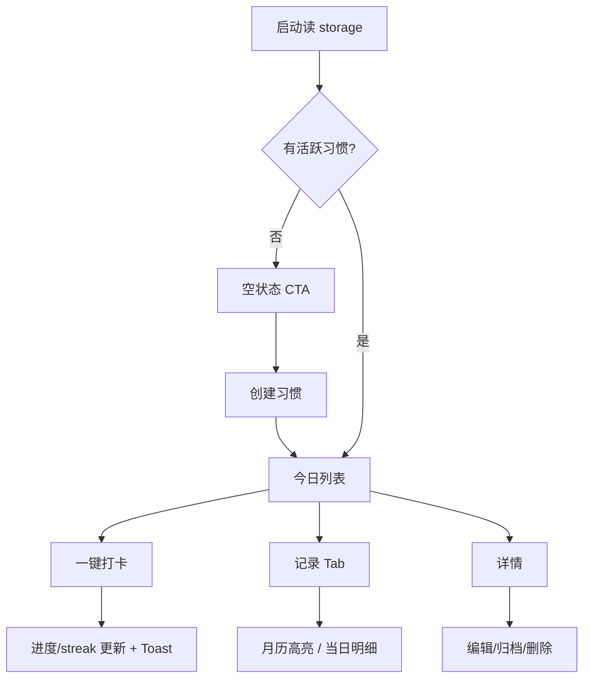

# 02 · 信息架构与流程

## 1. 页面地图

```
Tab
├── 今日 Today          # 主战场
└── 记录 Records        # 回顾

独立页
├── 创建 Create         # 模板 + 自定义（≤2 步）
└── 详情 HabitDetail    # 编辑 / 归档 / 删除
```

**首屏信息预算（红线）**  
只允许：品牌识别 + 今日进度 + 习惯列表 + 添加入口。  
禁止：排行、名言、运营位、复杂统计墙。

## 2. 主路径



## 3. 异常 / 支路径

| 场景 | 行为 |
| --- | --- |
| 标题为空 | 禁止保存 + inline/Toast |
| 活跃习惯 ≥ 7 | 拦截创建并提示专注 |
| 存储写失败 | Toast「保存失败，请重试」 |
| 取消打卡 | Modal 确认后删除今日 CheckIn 并重算 |
| 打卡连点 | 300–500ms 锁定，忽略重复 |
| 习惯已归档 | 今日不展示；记录仍可查标题/痕迹 |
| 习惯真删 | 级联删除其 checkIns |

## 4. 状态机

### 习惯在「今日」

`todo` →（打卡）→ `done` →（取消确认）→ `todo`  
`archived`：不出现在今日列表

### 页面

`loading` → `empty` | `ready` | `error`

### 打卡操作

`idle` → `submitting` → `success` | `fail`

## 5. 用户故事（抽样）

**US-1 首次创建**  
As a 新用户，I want 用模板快速创建一个小习惯，So that 我能立刻开始打卡。  
- Given 无习惯  
- When 选择「喝水 1 杯」并保存  
- Then 回到今日且出现 1 条 todo

**US-2 打卡**  
As a 用户，I want 一键完成今日打卡，So that 我看到进度与连续天数。  
- Given 今日未打卡  
- When 点击打卡  
- Then 状态为 done，进度 +1，streak 按策略 A 更新

**US-3 取消**  
- Given 今日已打卡  
- When 再次点击并确认取消  
- Then 今日 CheckIn 删除，进度与 streak 立即重算
