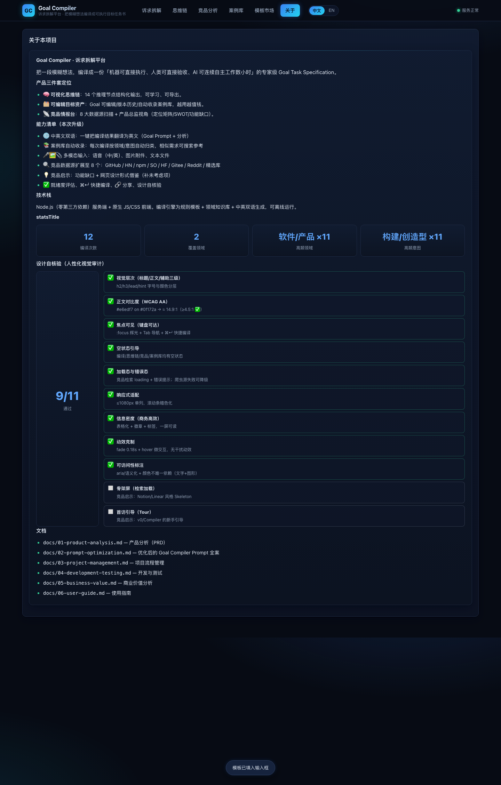

# Goal Compiler · 诉求拆解平台

> 把一段**模糊想法**，编译成一份「机器可直接执行、人类可直接验收、AI 可连续自主工作数小时」的专家级 **Goal Task Specification**。



## 这是什么

一个**零依赖、本地运行**的网页平台，包含 4 大核心能力：

1. **诉求拆解**：输入一句话/一段描述 → ①-⑧ 结构化分析 + ⑨ 20 段 Machine-Executable Goal；
2. **完整思维链**：14 个推理节点结构化输出（输入/推理/结论/证据/决策），**可学习、可导出**；
3. **可人工编辑**：最终 Goal Prompt 支持编辑、复制、下载、存草稿、历史恢复；
4. **竞品分析**：**8 大数据源**（GitHub / Hacker News / npm / StackOverflow / HuggingFace / Gitee / Reddit / 精选库），**产品总监视角**输出定位矩阵、SWOT、功能缺口与设计形式借鉴。

## 本次升级（v3）

- 🌐 **中英文双语**：一键把编译结果（Goal Prompt + ①-⑧ 分析）翻译为英文
- 📚 **案例库自动收录**：每次编译按领域/意图自动归类，相似需求可搜索参考分析
- 🎤🖼📎 **多模态输入**：语音（中/英）、图片附件、文本文件（.txt/.md/.csv/.json…）
- 🔍 **数据源扩展至 8 个**：npm / StackOverflow / HuggingFace / Gitee / Reddit 新增
- 💡 **竞品启示**：功能缺口清单 + 网页设计形式借鉴（补未考虑项）
- ✅ **就绪度评估**、⌘↵ 快捷编译、🔗 复制分享、设计自核验（人性化视觉审计）

## 本次升级（v4）

- 🧩 **一键导出可安装 SKILL.md**：编译结果可直接导出为 `.claude/skills` / `.codex/skills` 可安装技能（对标 khazix/superpowers 生态）
- 📋 **模板库（预设诉求 ×12）**：覆盖 SaaS/小程序/AI Agent/数据看板/爬虫/内容/学习/创业/增长/调研/面试/复盘，一键填入
- 📈 **本地用量统计**：编译次数/覆盖领域/高频领域/高频意图（隐私友好，替代云端埋点）
- 🗂 **案例库只收集不同类型**：按「领域·意图」去重，每种类型仅保留最新一条
- 📐 **竞品评分规则公开**：5 维 0-5 分（相关度/产品化/拆解深度/采纳度/威胁度）+ 定位矩阵象限规则
- 🗃 **竞品页按分类区域重组**：Skill / 仓库 / SaaS / 网页应用 / MCP / npm / AI 模型 / 社区讨论 分区展示（含平均威胁度）

## 本次升级（v5）

- 🔍 **输入框历史建议**：聚焦/输入时下拉推荐历史输入（草稿 + 已收录案例 + 内置用例），支持点击与 ↑↓/Enter/Esc 键盘选择
- 🧠 **思维链改为思维框图**：「理解 → 建模 → 架构 → 执行」四阶段泳道 + 箭头连接；点击任一主逻辑节点弹出**解释弹窗**（输入/推理/结论/证据/决策），支持 ←/→ 前后节点导航；保留列表模式可切换
- ✅ 列表模式 / 框图模式一键切换；「▶ 逐步演示」在框图模式高亮节点

## 本次升级（v6）

- 🎯 **输入需求型竞品分析**：一键「用当前需求分析」，全网数据围绕你的诉求展开；「📊 本产品竞品分析报告」弹窗始终可查（定位/优势/劣势/机会/威胁/行动清单）
- 🧠 **竞品启示结构化思维框图**：功能缺口 + 设计形式借鉴合并为分类节点框图，点击节点弹窗查看详细说明；新增**能力雷达图 / 威胁 Top5 / 分类分布**图表
- 🐙 **修复数据源 403**：Reddit 改走公开 RSS、Gitee 换浏览器 UA、新增 Dev.to —— 9 源全部可用（实测 errors: none）
- 🧩 **模板市场新页面**：内置模板 ×12 + 开源 GitHub 集合 ×18（Anthropic Skills / awesome-claude-skills / superpowers / 提示词库等），按分类展示、可搜索、一键填入输入框；**输入框自动关联推荐模板**
- 💬 **AI 多轮澄清式输入**：规则引擎逐轮提问（用户/时间盒/预算/验收/形态/背景），回答累积为 Q&A 上下文再编译
- 🖼 **案例库升级为画廊形态**：分类渐变横幅 + 意图图标 + 关键词，浏览体验更直观
- 📊 **产品总监建议汇总竞品启示**：市场格局 + 威胁 Top + 已补/规划功能 + 行动要点
- 📐 **并列显示优化**：功能缺口与设计借鉴、本产品报告的优势/劣势等成对面板双列并排

## 本次升级（v7）

- 🎛 **竞品分析拆分为双界面**：「📊 本产品竞品分析」（定位/雷达/优势劣势/机会威胁/行动清单，常驻可查可导出）+「🎯 需求竞品分析」（围绕你填写的需求展开，全网检索）
- 📉 **评分规则缩小占比**（折叠为紧凑块），**突出「分析对象」一行**（高亮栏）
- 🎯 **相关性增强**：分类区域按相关度排序 + 「仅高相关」过滤；新增**「最接近需求的项目 Top3」**（按相关度检索出最贴近需求/功能的项目地址）
- 🗺 **定位矩阵与市场格局并排同排显示**（comp-grid-2 双列）
- 🧠 **需求结构思维框图**：展示所填需求的结构思维（目标树/假设/补充建议），点击节点弹窗说明（可切换「需求结构 / 竞品启示」）
- 🧑‍💼 **专家版思维链**：思维链新增「专家版诉求思维模式拆解」总览（阶段/节点/决策/证据/假设/风险/质量指标）+ 14 个节点全部标注**方法论标签**，弹窗含**专家要点**
- 🐙 **修复 Reddit 429**：按源 TTL 缓存 + 并发上限 4 + 多主机回退（www/old/np），限流时静默降级（不再显示「源暂不可用」）
- 🖼 **输入面板优化**：AI 多轮澄清 + 模板库提升为常驻显眼区块

## 本次升级（v8）

- 🔗 **本产品竞品分析与需求竞品分析流程对齐**：本产品视图新增「关联数据源（9 源）徽标」+「同口径扫描」按钮与结果（威胁 Top3、按源计数、GitHub 认证状态）
- 🐙 **解决 GitHub 未认证限流**：支持配置 **GitHub Token（可选，未认证 10 次/分 → 认证 5000 次/时）**，本地保存、随请求透传；状态徽标实时显示；限流错误给出友好提示
- 📋 **模板库/AI 澄清重设计（突出且不拥挤）**：模板库改为**单行横向滚动条**；AI 多轮澄清改为**可折叠卡片**默认收起，展开后空间充足；推荐模板轻量内联
- 🎨 **UI 专家级优化**：详见 [docs/07-ui-expert-prompt.md](docs/07-ui-expert-prompt.md)（自生成极致设计 Prompt + 执行清单：4px 间距基准、焦点辉光、卡片/按钮/标签一致性、响应式精修）

设计风格：**商务科技深色**（深空蓝黑底 + 电光蓝/青渐变、玻璃拟态卡片、高信息密度，保持商务高效简约）。

## 快速开始

```bash
cd 05-projects/09-goal-compiler
node server/server.mjs 8910
# 浏览器打开 http://localhost:8910
```

> 无需 `npm install`（Node ≥ 18，零第三方依赖）。

## 测试

```bash
node --test tests/compile.test.mjs tests/caselib.test.mjs tests/skilllib.test.mjs tests/dialogue.test.mjs tests/api.test.mjs tests/api2.test.mjs   # 单测+案例库+SKILL+对话+API（21/21）
node tests/e2e-cdp.mjs                                                                                                                                  # 浏览器端到端（58/58，需本机 Chrome）
```

## 3 个内置测试用例

| 用例 | 类型 | 演示重点 |
|------|------|----------|
| AI 面试官工具 | 产品/构建 | 目标树、边界、验收标准 |
| 报销发票小程序 | 效率/自动化 | 自动补全你没考虑到的功能 |
| AI 英语口语提升 | 学习/成长 | 个人目标 → 里程碑与自测关卡 |

## 技术架构

```
server/  server.mjs（HTTP+API） · crawler.mjs（GitHub/HN/精选库爬虫）
public/  index.html · styles.css · app.mjs · competitive.mjs
         compiler/（analyzer → goal → chain → index）＝ 优化版 Goal Compiler Prompt 的规则化实现
data/    cases.json（3 用例） · competitors.db.json（16 精选竞品）
docs/    项目制文档 6 篇 + 截图
tests/   单测 · API 测试 · CDP 端到端
```

## 项目制文档

| 文档 | 内容 |
|------|------|
| [docs/01-product-analysis.md](docs/01-product-analysis.md) | 产品分析（PRD） |
| [docs/02-prompt-optimization.md](docs/02-prompt-optimization.md) | **优化后的 Goal Compiler Prompt 全案**（12 项缺口 + v2.0 全文） |
| [docs/03-project-management.md](docs/03-project-management.md) | 项目流程管理 |
| [docs/04-development-testing.md](docs/04-development-testing.md) | 开发与测试 |
| [docs/05-business-value.md](docs/05-business-value.md) | 商业价值分析 |
| [docs/06-user-guide.md](docs/06-user-guide.md) | 使用指南 |

## 参考 · 开源致谢

Goal Compiler 是学习 / 面试作品，方法与验收标准参考了下列公开项目，**在此诚恳致谢**：

| 参考源 | 作者 | 链接 | 我们学到了什么 |
|--------|------|------|----------------|
| **khazix-skills · leader** | [KKKKhazix](https://github.com/KKKKhazix) | [leader/SKILL.md](https://github.com/KKKKhazix/khazix-skills/blob/main/leader/SKILL.md) | 防作弊验收、≤4000 字符目标书结构 |
| GitHub Search API | [GitHub](https://github.com) | [docs.github.com/rest](https://docs.github.com/en/rest) | 公开仓库检索（遵守限流） |
| Hacker News Algolia | HN / Algolia | [hn.algolia.com/api](https://hn.algolia.com/api) | 公开讨论检索 |

原始诉求来自用户提供的「极致版 Goal Compiler」Prompt。竞品与案例数据仅供学习研究；错误与改造责任在本仓。

## 免责说明

- 本平台编译引擎为**规则模板 + 领域知识库**（确定性、可离线），非 LLM 生成；P2 规划接入 LLM 增强模式。
- 竞品数据来自公开 API，仅供学习研究；GitHub 未认证限流 10 次/分。
