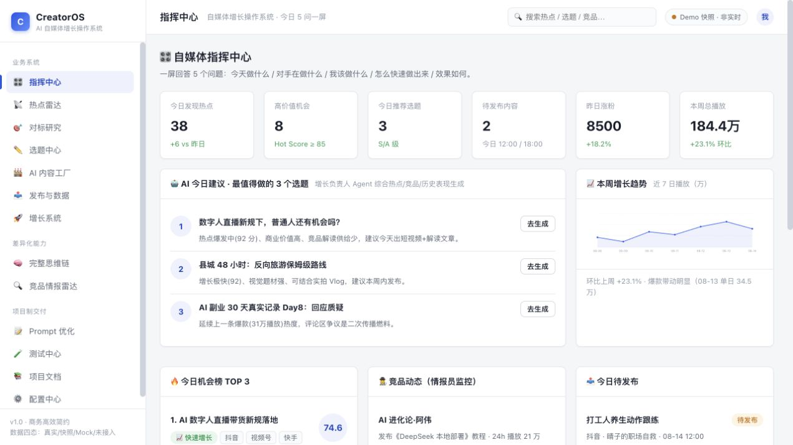
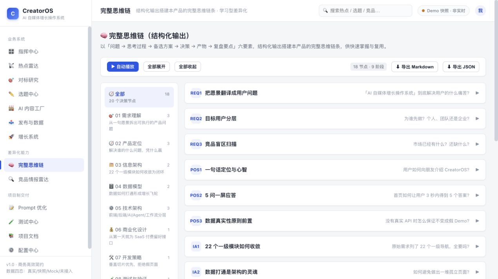
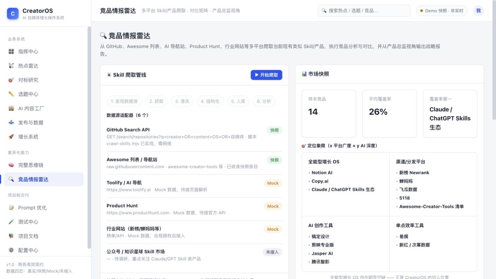

# CreatorOS · AI 自媒体全平台增长操作系统

> 项目制完整交付：Web 端平台 + 完整思维链结构化输出 + 竞品情报雷达 + 3 个测试用例 + 项目文档包
> 目录：`05-projects/10-creatoros-platform/`

---

## 🚀 快速开始

```bash
cd 05-projects/10-creatoros-platform
npm start          # 启动静态服务 → http://localhost:8787
npm test           # 运行 3 个核心引擎测试用例（Node）
npm run seed       # 重新生成 data/ 快照 JSON
npm run crawl      # 有网环境从 GitHub 等抓取真实竞品数据（离线自动回退快照）
```

浏览器打开 http://localhost:8787 即可使用（零依赖、无需构建）。

## 🎯 产品定位

**让一个人拥有一支完整的 AI 自媒体团队。**
心智公式：`数据 → 洞察 → 选题 → 创作 → 发布 → 复盘 → 反哺`

一屏回答 5 个问题：今天什么值得做 / 对手在做什么 / 我该做什么 / 怎么快速做出来 / 效果如何。

## 🧭 功能地图（13 个视图）

| 分组 | 视图 | 说明 |
|------|------|------|
| 业务系统 | 指挥中心 | 5 问一屏 + 内容生产看板 + 增长趋势 |
| | 热点雷达 | Hot Score 评分 / 频段徽章 / AI 内容机会 |
| | 对标研究 | 账号情报 / 一键暴力拆解 / 对标矩阵 |
| | 选题中心 | AI 选题工厂 / 7 维 Topic Score |
| | AI 内容工厂 | 文案生成 / 变体引擎 / 视频脚本分镜 |
| | 发布与数据 | 内容日历 / 发布中心 / 数据中心 / AI 复盘 |
| | 增长系统 | AI 顾问 / 9 Agent 团队 / 工作流 / 知识库 |
| 差异化能力 | **完整思维链** | 9 阶段 18 节点结构化输出 · 自动播放 · 导出 |
| | **竞品情报雷达** | 多平台 Skill/产品爬取 · 对比矩阵 · 产品总监报告 |
| 项目制交付 | Prompt 优化 | 原始诉求 → 补充 14 项方向与功能 · 优化版全文 |
| | 测试中心 | 3 个核心引擎用例，浏览器一键运行 |
| | 项目文档 | 产品分析 / 项目管理 / 开发测试 / 商业价值 / 完成报告 |
| | 配置中心 | Provider Adapter / Model Router / 数据信任 |

## 🧠 完整思维链（学习型差异化）

以「问题 → 思考过程 → 备选方案 → 决策 → 产物 → 复盘要点」六要素，
结构化输出搭建本产品的完整思维链条（需求理解 → 产品定位 → 信息架构 → 数据模型 →
技术架构 → 商业化设计 → 开发策略 → 测试验证 → 增长运营），支持自动播放与 Markdown/JSON 导出。
可在「思维链」视图查看，或直接阅读 `data/thinking-chain.json`。

## 🔍 竞品情报雷达

- **爬取管线**：发现源 → 抓取 → 清洗 → 结构化 → 入库 → 分析（`src/lib/crawler.js`）
- **数据源适配器**：GitHub Search API / Awesome 列表 / Toolify / Product Hunt / 行业网站
- **分析输出**：特性覆盖率、对比矩阵、市场空白带、定位象限、产品总监战略报告
- **真实性**：离线/无 API 时使用快照并标注（`data/competitors-snapshot.json`），绝不伪造；
  有网执行 `npm run crawl` 抓取真实数据合并入库

## 🧪 测试用例（3 个 · 双端一致）

| 用例 | 对象 | 验证点 |
|------|------|--------|
| TC-01 热点评分引擎 | `src/lib/scoring.js` | 分数区间 / 排序 / 频段 / 徽章 |
| TC-02 选题评分引擎 | `src/lib/scoring.js` | 加权评分 / 推荐阈值 / 优先级 |
| TC-03 竞品分析引擎 | `src/lib/competitor.js` | 覆盖率 / 空白带 / 象限 / 报告完整性 |

浏览器「测试中心」视图与 `npm test` 共用同一断言逻辑。

## 📚 项目制文档

| 文档 | 内容 |
|------|------|
| [00-产品分析](docs/00-产品分析.md) | 需求/用户/竞品/定位/信息架构/数据模型/验收 |
| [01-项目流程管理](docs/01-项目流程管理.md) | WBS / 里程碑 / 风险登记册 / 质量门禁 |
| [02-开发与测试](docs/02-开发与测试.md) | 技术架构 / 引擎说明 / API 接入点 |
| [03-商业价值分析](docs/03-商业价值分析.md) | 市场 / 定价 / 单位经济 / 增长 / 壁垒 |
| [04-产品完成报告](docs/04-产品完成报告.md) | 已完成 / Mock / 未实现 / 技术债 / 路线 |
| [05-优化版Prompt](docs/05-优化版Prompt.md) | 自动补充优化的增强版 Prompt（14 项补充） |

## 📁 目录结构

```text
10-creatoros-platform/
├── index.html                  # 入口（纯静态 SPA）
├── src/
│   ├── styles.css              # 商务高效简约设计系统
│   ├── app.js                  # 路由/导航/工具
│   ├── lib/                    # scoring / competitor / crawler / render-md（UMD 可测）
│   ├── data/                   # seed / competitors / thinking-chain
│   └── views/                  # 13 个视图
├── data/                       # competitors-snapshot.json · thinking-chain.json
├── docs/                       # 项目制文档 6 份
├── scripts/                    # serve / seed-data / crawl-skills
└── tests/                      # test-cases.mjs · run-tests.mjs
```

## ⚠️ 数据真实性声明

本版本为**演示快照数据**（Demo/快照/Mock 四态标注）。真实热点、发布、AI 生成均需接入
对应 Provider Adapter（详见配置中心与 02-开发与测试.md），未接入前系统不伪装成功。

## 🔗 相关链接

- 本目录 GitHub：https://github.com/lili171819931-collab/ai-interview-sprint/tree/main/05-projects/10-creatoros-platform
- 项目集上级：https://github.com/lili171819931-collab/ai-interview-sprint/tree/main/05-projects

## 🖼️ 界面预览

| 视图 | 预览 |
|------|------|
| 指挥中心 |  |
| 完整思维链 |  |
| 竞品情报雷达 |  |
| 测试中心 |  |
