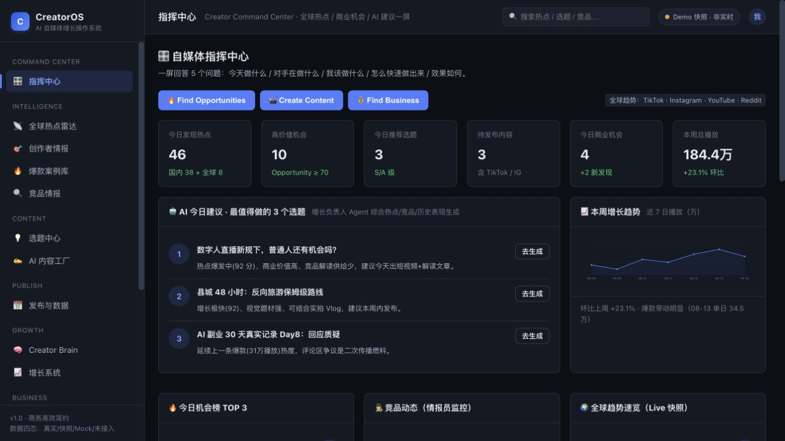
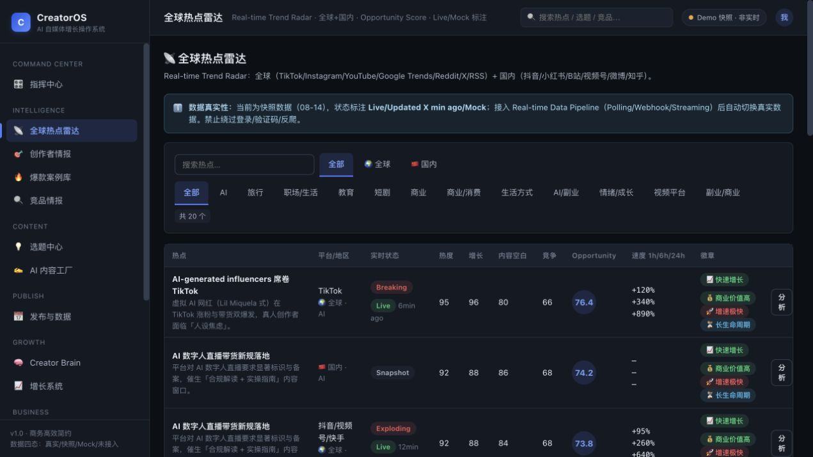
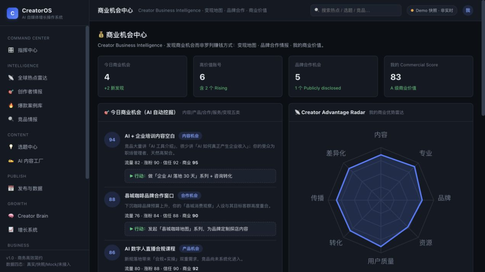
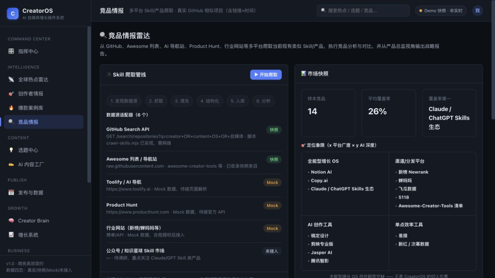
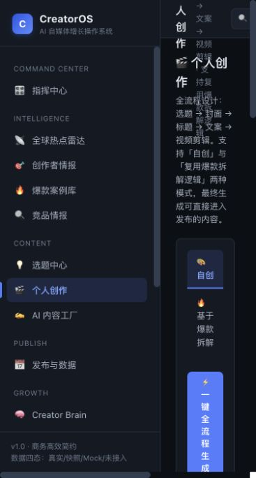
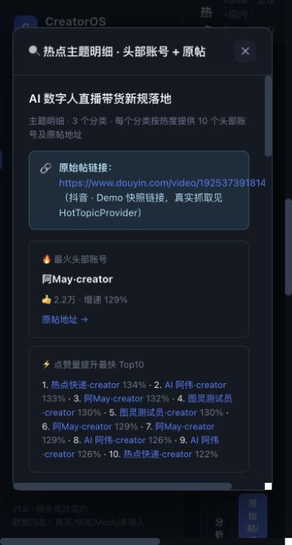
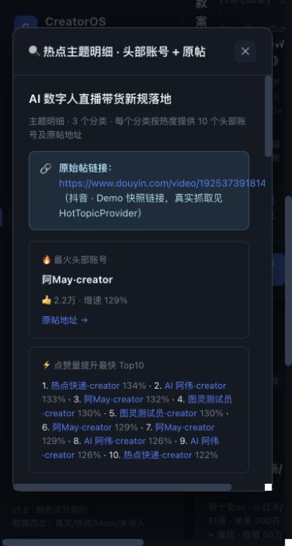

# CreatorOS · AI Creator Intelligence & Growth OS

> AI 自媒体全平台情报 + 爆款拆解 + 内容生产 + 商业变现操作系统（V2）
> 项目制完整交付：Web 端平台（深色商务极简） + 完整思维链 + 竞品情报雷达 + **真实联网 GitHub 相似项目** + 3 个测试用例 + 项目文档包
> 目录：`05-projects/10-creatoros-platform/`

---

## 🚀 快速开始

```bash
cd 05-projects/10-creatoros-platform
npm start          # 启动静态服务 → http://localhost:8787
npm test           # 运行 3 个核心引擎测试用例（Node）
npm run seed       # 重新生成 data/ 快照 JSON
npm run crawl      # 竞品快照爬虫（离线自动回退）
npm run crawl:github  # 【联网】抓取真实 GitHub 相似项目（链接+时间+Star）
```

浏览器打开 http://localhost:8787 即可使用（零依赖、无需构建）。

## 🎯 产品定位（V2）

**CreatorOS —— AI 时代一个人的自媒体公司操作系统。**
`Discover. Decode. Create. Publish. Grow. Monetize.`

三个核心闭环：**内容闭环**（热点→选题→创作→发布→数据→复盘）· **竞品闭环**（竞品→爆款→拆解→规律→创新）· **商业闭环**（账号→受众→影响力→商业机会→品牌合作→收入）。

## 🧭 功能地图（16 个视图 · V2 导航）

| 分组 | 视图 | 说明 |
|------|------|------|
| COMMAND CENTER | 指挥中心 | 5 问一屏 + 全球趋势 + 商业机会 + 3 CTA |
| INTELLIGENCE | 全球热点雷达 | 全球+国内 · Opportunity Score · Live/Mock 标注 · 速度 |
| | 创作者情报 | 账号分层 Mega→Emerging · 8 维暴力拆解 · 对标矩阵 |
| | 爆款案例库 | 3 大真实案例 · Cover/Copy/Script/Timeline 四视图工作台 |
| | 竞品情报 | 14 个产品对比 + **真实 GitHub 相似项目（链接+时间）** |
| CONTENT | 选题中心 | AI 选题工厂 · 内容战略矩阵 · Commercial Potential |
| | 个人创作 | 全流程：选题→封面→标题→文案→视频剪辑 · 支持复用爆款拆解逻辑 |
| | AI 内容工厂 | **中英双语** · 变体 · **多平台重构** · 脚本 + Timeline |
| PUBLISH | 发布与数据 | Omnichannel（TikTok/IG/抖音/小红书/B站/视频号） · 数据回收 |
| GROWTH | Creator Brain | Creator DNA · 优势雷达 · 知识库 |
| | 增长系统 | 12 Agent + Creator Orchestrator · 工作流 |
| BUSINESS | 商业机会中心 | 变现地图 · 品牌合作情报 · Commercial Score |
| SYSTEM | 完整思维链 / Prompt 优化 / 测试中心 / 项目文档 / 配置中心 | 学习型差异化 + 合规中心 + Platform Adapter |

## 🐙 真实联网数据（GitHub 相似项目 · 链接 + 时间）

已通过 GitHub Search API 联网抓取 **74 个真实相似项目**（Star/更新时间/创建时间/链接），
筛选出 41 个相关项目入库并展示在「竞品情报 → GitHub 相似项目」：

- **多平台自动发布**：[dreammis/social-auto-upload](https://github.com/dreammis/social-auto-upload) ★14.2k（更新 2026-08-14）
- **AI 短剧生成**：[chatfire-AI/huobao-drama](https://github.com/chatfire-AI/huobao-drama) ★13.9k（更新 2026-08-14）
- **开源 AI 短剧创作**：[HBAI-Ltd/Toonflow-app](https://github.com/HBAI-Ltd/Toonflow-app) ★13.9k（更新 2026-08-14）
- **一人企业方法论**：[easychen/opc-methodology](https://github.com/easychen/opc-methodology) ★16.6k（更新 2026-08-13）
- **AI YouTube Shorts**：[Anil-matcha/AI-Youtube-Shorts-Generator](https://github.com/Anil-matcha/AI-Youtube-Shorts-Generator) ★4.6k（更新 2026-08-14）
- **社媒 API**：[ayrshare/social-media-api](https://github.com/ayrshare/social-media-api) ★323（更新 2026-08-12）
- **爆款拆解 Skill**：[sharon-laicc/viral-video-decomposer](https://github.com/sharon-laicc/viral-video-decomposer)（更新 2026-08-11）

完整 41 个相关项目（含时间戳）见 [docs/06-真实GitHub相似项目.md](docs/06-真实GitHub相似项目.md) 与 `data/github-similar-projects.json`（74 条全量原始数据）。

## 🧠 完整思维链（学习型差异化）

9 阶段 18 节点，「问题→思考→备选→决策→产物→复盘」六要素结构化输出，支持自动播放与 Markdown/JSON 导出。可在「完整思维链」视图查看。

## 🧪 测试用例（3 个 · 双端一致）

| 用例 | 对象 | 验证点 |
|------|------|--------|
| TC-01 热点评分引擎（V2 Opportunity Score） | `src/lib/scoring.js` | 分数区间 / 排序 / 频段 / 徽章 |
| TC-02 选题评分引擎 | `src/lib/scoring.js` | 加权评分 / 推荐阈值 / 优先级 |
| TC-03 竞品分析引擎 | `src/lib/competitor.js` | 覆盖率 / 空白带 / 象限 / 报告完整性 |

浏览器「测试中心」视图与 `npm test` 共用同一断言逻辑（15/15 通过）。

## 📚 项目制文档

| 文档 | 内容 |
|------|------|
| [00-产品分析](docs/00-产品分析.md) | 需求/用户/竞品/定位/信息架构/数据模型/验收 |
| [01-项目流程管理](docs/01-项目流程管理.md) | WBS / 里程碑 / 风险登记册 / 质量门禁 |
| [02-开发与测试](docs/02-开发与测试.md) | 技术架构 / 引擎说明 / API 接入点 |
| [03-商业价值分析](docs/03-商业价值分析.md) | 市场 / 定价 / 单位经济 / 增长 / 壁垒 |
| [04-产品完成报告](docs/04-产品完成报告.md) | 已完成 / Mock / 未实现 / 技术债 / 路线 |
| [05-优化版Prompt](docs/05-优化版Prompt.md) | V1 补充 14 项 + V2 升级说明 |
| [06-真实GitHub相似项目](docs/06-真实GitHub相似项目.md) | 真实联网爬取的相似项目（链接+时间） |

## 📁 目录结构

```text
10-creatoros-platform/
├── index.html                  # 入口（纯静态 SPA · 深色商务极简）
├── src/
│   ├── styles.css              # V2 深色设计系统（Linear/Bloomberg 质感）
│   ├── app.js                  # V2 导航（16 视图）
│   ├── lib/                    # scoring / competitor / crawler / render-md（UMD 可测）
│   ├── data/                   # seed / competitors / thinking-chain / github-live（真实爬取）
│   └── views/                  # 16 个视图
├── data/                       # competitors-snapshot · thinking-chain · github-similar-projects（74 条真实）
├── docs/                       # 项目制文档 7 份
├── scripts/                    # serve / seed / crawl / crawl:github / curate
└── tests/                      # test-cases.mjs · run-tests.mjs
```

## ⚠️ 数据真实性声明

- **真实数据**：GitHub 相似项目（联网抓取 · 含时间戳）
- **快照/Mock**：热点/账号/发布/AI 生成（全站四态标注，未接入前不伪装成功）
- 实时热点架构：TrendSnapshot 时间序列 + Live/Updated X min ago/Mock；禁止绕过登录/验证码/反爬。

## 🔗 相关链接

- 本目录 GitHub：https://github.com/lili171819931-collab/ai-interview-sprint/tree/main/05-projects/10-creatoros-platform
- 项目集上级：https://github.com/lili171819931-collab/ai-interview-sprint/tree/main/05-projects

## 🖼️ 界面预览（V2 深色主题）

| 视图 | 预览 |
|------|------|
| 指挥中心（深色） |  |
| 全球热点雷达 |  |
| 商业机会中心 |  |
| 竞品情报 |  |
| 完整思维链 |  |
| 测试中心 |  |
| 个人创作（全流程） |  |
| 热点明细弹窗（Top10 账号+原帖） |  |
| 爆款拆解封面图 |  |


## ✨ V2.5 新增（本次）

1. **类似项目链接嵌入网页并可打开**：竞品情报 → 🐙 GitHub 相似项目（41 张卡片），项目名/URL 均为可点击链接（82 个可点链接），一键在新标签打开。
2. **热点原始帖 + 分类明细弹窗**：全球热点每行新增「原始帖/明细」按钮 → 弹窗展示原始帖链接、最火头部账号、点赞量提升最快 Top10，以及 3 个分类主题明细，每个分类按热度提供 **10 个头部账号 + 原帖地址**。
3. **暴力拆解升级**：新增「图文视频文案拆解」（开头/中段/结尾/情绪线/关键词/结构，不止标题）；封面以**真实图片形式**直接展示（SVG 封面生成器），爆款案例库 Cover 视图支持实时编辑「我的封面」。
4. **个人创作界面**：全流程设计（选题 → 封面 → 标题 → 文案 → 视频剪辑），支持「自创」与「基于爆款拆解逻辑」两种模式，一键全流程生成后可直接进入发布中心。
